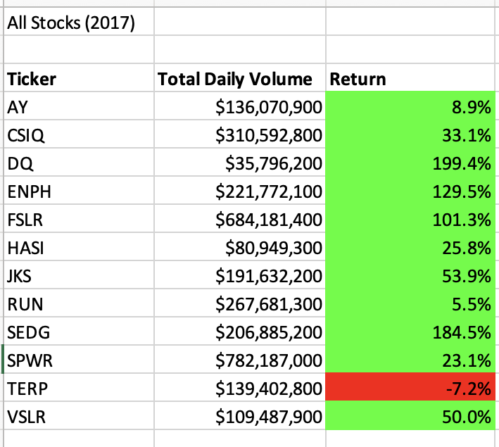
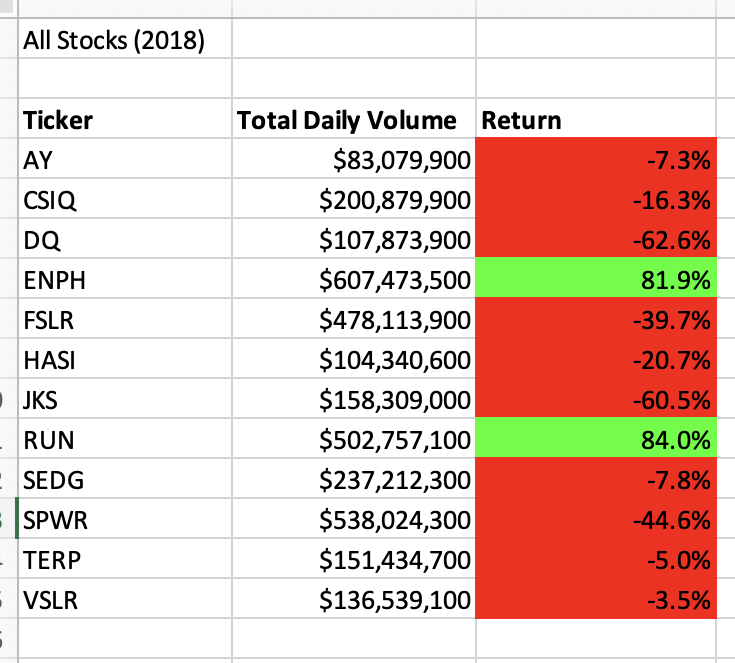
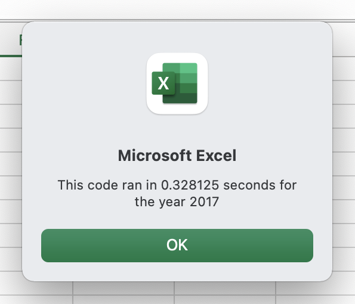
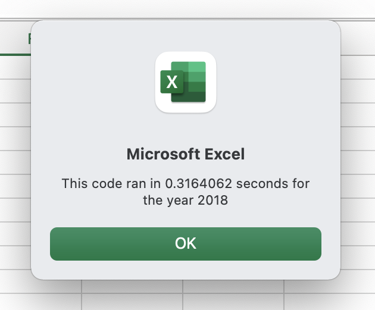

# Refactor VBA Code and Measure Performance

## Overview of Project
With this challenge, we expanded the dataset to include the complete stock market data sheets. Our previous code in VBA would not work for the entire data set so we modified, refactored, so that we were able loop through all the data at once.  

### Purpose
Purpose of refactoring is that instead of writing new code, we can modify the existing code to save time and include larger data sets in shorter script run times. in VBA, using defactoring, we were able to include multiple years' stock data set.

## Analysis and Challenges
### Result Analysis

After running refactored macros, we have observed that Steve's stock list did not perform well in 2018. They were all down but two. Two images below demonstrate the difference between 2017 and 2018 return performances with their volumes and return percentages.

## Summary
### Advantages and Disadvantages of Refactoring

There are a few challenges we face while refactoring our code.

- Making small changes will effect the entire outcome.

- When dealing with larger datasets, it can get complicated and overwhelming.

There are advantages of refactoring.

- We have better understanding and conrol over our code.
- Our macro is more organized and clear/clean to read.
- Main advantage we get from factoring is that significantly shorter VBA run times. See below images for newly edited macro run times.

